# TurtleBot3 Architecture

## Component Diagram

```mermaid
graph TB
    subgraph host["Host Machine (Ubuntu 24.04)"]
        F310[/"F310 Gamepad\n/dev/input/js0"/]
    end

    subgraph sim_container["Docker: turtlebot3_simulator\nosrf/ros:jazzy-desktop-full · network_mode: host · Fast-DDS · GZ_IP=127.0.0.1"]

        subgraph gz["Gazebo Harmonic (gz sim)"]
            GZ_SIM["gz server\nPhysics + Sensors"]
            GZ_GUI["gz GUI client\n(headless:=false only)"]
        end

        subgraph bridge_layer["ROS ↔ Gazebo Bridge"]
            BRIDGE["ros_gz_bridge\nbridge_params.yaml"]
            RSP["robot_state_publisher\nURDF → /tf_static"]
        end

        subgraph bringup["tb3_bringup (launch orchestration)"]
            L_SIM["sim_bringup.launch.py\nsim_house.launch.py"]
            L_GAMEPAD["gamepad.launch.py"]
            L_WANDER["wanderer.launch.py"]
            L_SLAM["slam.launch.py"]
            L_NAV2["nav2.launch.py"]
            L_DEMO["capability_demo.launch.py"]
            L_TELEOP["teleop.launch.py"]
        end

        subgraph monitor["tb3_monitor"]
            LIDAR_MON["lidar_monitor\n/scan → /closest_obstacle\n@ 5 Hz"]
            HEALTH["health_monitor\n/battery_state + /imu → log"]
            MOCK_BAT["mock_battery\n/battery_state @ 1 Hz"]
        end

        subgraph controller["tb3_controller"]
            JOY["joy_node\n/dev/input → /joy @ 20 Hz"]
            TTJ["teleop_twist_joy\n/joy → /cmd_vel_raw"]
            GM["gamepad_manager\n/joy + /cmd_vel_raw → /cmd_vel\ne-stop gating (B/A/Y)"]
            WANDER["wanderer\n/scan + /estop → /cmd_vel\nreactive obstacle avoidance"]
            PATROL["patrol\n/estop + Nav2 → waypoints"]
            SCAN_ACT["scan_action_server\n/tb3_scan_360 action"]
            TTK["teleop_twist_keyboard\n→ /cmd_vel (TTY)"]
        end

        subgraph autonomous["Autonomous Stack"]
            SLAM["slam_toolbox\nonline_async\n/scan → /map + map→odom TF"]
            NAV2["Nav2 Stack\nbt_navigator + DWB planner\n/navigate_to_pose action"]
        end
    end

    subgraph robot_container["Docker: turtlebot3_robot\nrobotis/turtlebot3:jazzy-sbc-latest (RPi4 arm64)\n[Phase 5 — hardware deployment]"]
        HW_TB3["TurtleBot3 Burger\nHardware + OpenCR"]
    end

    %% Hardware input
    F310 -->|"/dev/input bind-mount"| JOY

    %% Launch file relationships
    L_SIM -.->|starts| GZ_SIM
    L_SIM -.->|starts| BRIDGE
    L_SIM -.->|starts| RSP
    L_GAMEPAD -.->|starts| JOY
    L_GAMEPAD -.->|starts| TTJ
    L_GAMEPAD -.->|starts| GM
    L_WANDER -.->|starts| LIDAR_MON
    L_WANDER -.->|starts| WANDER
    L_SLAM -.->|starts| SLAM
    L_NAV2 -.->|starts| NAV2
    L_DEMO -.->|starts| SLAM & NAV2 & LIDAR_MON
    L_DEMO -.->|mode:=patrol| PATROL
    L_DEMO -.->|mode:=wanderer| WANDER
    L_TELEOP -.->|starts| TTK

    %% Gazebo internal
    GZ_SIM --> GZ_GUI

    %% Bridge: Gazebo → ROS
    GZ_SIM <-->|"gz-transport\n(loopback)"| BRIDGE
    BRIDGE -->|"/scan LaserScan"| LIDAR_MON
    BRIDGE -->|"/scan LaserScan"| WANDER
    BRIDGE -->|"/scan LaserScan"| SLAM
    BRIDGE -->|"/odom Odometry"| SCAN_ACT
    BRIDGE -->|"/imu Imu"| HEALTH
    BRIDGE -->|"/clock Clock"| autonomous
    BRIDGE -->|"/tf TFMessage"| autonomous

    %% Bridge: ROS → Gazebo
    GM -->|"/cmd_vel Twist"| BRIDGE
    WANDER -->|"/cmd_vel Twist"| BRIDGE
    NAV2 -->|"/cmd_vel Twist"| BRIDGE
    TTK -->|"/cmd_vel Twist"| BRIDGE

    %% Gamepad chain
    JOY -->|"/joy Joy"| TTJ
    JOY -->|"/joy Joy"| GM
    TTJ -->|"/cmd_vel_raw Twist"| GM

    %% E-stop signal
    GM -->|"/estop Bool\nRELIABLE+TRANSIENT_LOCAL"| WANDER
    GM -->|"/estop Bool"| PATROL

    %% Monitoring
    MOCK_BAT -->|"/battery_state BatteryState"| HEALTH
    LIDAR_MON -->|"/closest_obstacle Float32"| HEALTH

    %% SLAM → Nav2
    SLAM -->|"/map OccupancyGrid"| NAV2
    SLAM -->|"map→odom TF"| NAV2

    %% Nav2 → Patrol
    PATROL -->|"/navigate_to_pose action"| NAV2

    %% Hardware (Phase 5)
    BRIDGE <-.->|"WiFi · DDS · Fast-DDS\n(Phase 5)"| HW_TB3

    %% Styles
    classDef launchFile fill:#2d4a6e,stroke:#5b8dd9,color:#fff
    classDef monitor fill:#2d6e3e,stroke:#5bd96e,color:#fff
    classDef controller fill:#6e2d2d,stroke:#d95b5b,color:#fff
    classDef gazebo fill:#4a3a6e,stroke:#9b7dd9,color:#fff
    classDef autonomous fill:#6e5a2d,stroke:#d9b45b,color:#fff
    classDef future fill:#444,stroke:#888,color:#aaa,stroke-dasharray:5

    class L_SIM,L_GAMEPAD,L_WANDER,L_SLAM,L_NAV2,L_DEMO,L_TELEOP launchFile
    class LIDAR_MON,HEALTH,MOCK_BAT monitor
    class JOY,TTJ,GM,WANDER,PATROL,SCAN_ACT,TTK controller
    class GZ_SIM,GZ_GUI,BRIDGE,RSP gazebo
    class SLAM,NAV2 autonomous
    class robot_container,HW_TB3 future
```



## Component Summary

```json
{
  "containers": {
    "turtlebot3_simulator": "osrf/ros:jazzy-desktop-full Docker container running the full Gazebo + ROS 2 simulation stack on the host machine",
    "turtlebot3_robot": "robotis/turtlebot3 Docker container for Phase 5 hardware deployment on the RPi 4 (arm64), communicates via WiFi DDS"
  },
  "gazebo": {
    "gz_server": "Gazebo Harmonic physics engine and sensor simulator; publishes /scan, /odom, /imu, /tf via gz-transport",
    "gz_gui": "Gazebo graphical client (skipped when headless:=true); renders the simulation viewport"
  },
  "bridge_layer": {
    "ros_gz_bridge": "Bidirectional bridge between Gazebo gz-transport and ROS 2 topics; converts /cmd_vel (Twist, not TwistStamped) and sensor topics",
    "robot_state_publisher": "Reads URDF and publishes static TF frames (/tf_static) for the TurtleBot3 link tree"
  },
  "tb3_bringup": {
    "sim_bringup.launch.py": "Foundation launch: starts Gazebo server, GUI, ros_gz_bridge, and robot_state_publisher for turtlebot3_world",
    "sim_house.launch.py": "Same as sim_bringup but loads the turtlebot3_house indoor world",
    "gamepad.launch.py": "Launches joy_node + teleop_twist_joy + gamepad_manager for F310 gamepad control",
    "teleop.launch.py": "Launches teleop_twist_keyboard for interactive keyboard driving (requires TTY)",
    "wanderer.launch.py": "Launches lidar_monitor + wanderer for autonomous reactive obstacle avoidance",
    "slam.launch.py": "Launches slam_toolbox online_async for SLAM mapping without Nav2",
    "nav2.launch.py": "Launches the Nav2 navigation stack (requires slam.launch.py for map→odom TF)",
    "capability_demo.launch.py": "Full M3 stack: SLAM + Nav2 + lidar_monitor + patrol or wanderer selectable via mode:= arg"
  },
  "tb3_monitor": {
    "lidar_monitor": "Subscribes /scan (LaserScan) and publishes /closest_obstacle (Float32) at 5 Hz; minimum distance extraction",
    "health_monitor": "Subscribes /battery_state and /imu; logs battery voltage, charge percentage, and IMU orientation",
    "mock_battery": "Publishes simulated /battery_state at 1 Hz for testing health_monitor without real hardware",
    "tf2_verifier": "Debug/test utility that verifies the map→base_link TF chain is complete and fresh; not a production node"
  },
  "tb3_controller": {
    "joy_node": "Reads F310 gamepad from /dev/input via SDL2 and publishes /joy (sensor_msgs/Joy) at 20 Hz",
    "teleop_twist_joy": "Maps F310 joystick axes to /cmd_vel_raw Twist; RB=deadman hold, LB=turbo",
    "gamepad_manager": "E-stop gate: passes /cmd_vel_raw → /cmd_vel; B=stop, A=clear, Y=shutdown; publishes /estop with RELIABLE+TRANSIENT_LOCAL QoS",
    "wanderer": "Reactive obstacle avoidance node; subscribes /scan and /estop, publishes /cmd_vel; forward/turn/stop state machine",
    "patrol": "Nav2 action client that cycles through hardcoded map-frame waypoints; cancels goal on /estop signal",
    "scan_action_server": "Action server providing /tb3_scan_360 (360° rotation) using odometry feedback; available for future use",
    "teleop_twist_keyboard": "Keyboard teleoperation; publishes /cmd_vel directly (requires interactive TTY session)"
  },
  "autonomous_stack": {
    "slam_toolbox": "online_async SLAM node; subscribes /scan, publishes /map (OccupancyGrid) and the map→odom TF transform",
    "nav2_stack": "Full Nav2 navigation stack (bt_navigator, DWB local planner, costmap servers); provides /navigate_to_pose action, publishes /cmd_vel"
  },
  "config_files": {
    "bridge_params.yaml": "Defines 7 ros_gz_bridge topic mappings including /cmd_vel as geometry_msgs/Twist (not TwistStamped)",
    "teleop_twist_joy.yaml": "F310 D-mode axis/button mapping: axis[4]=linear, axis[0]=angular, RB=deadman; velocity scales",
    "slam_params.yaml": "slam_toolbox tuning: 0.05 m/cell resolution, 3.5 m max range, Ceres solver, loop closure enabled",
    "nav2_params.yaml": "Nav2 tuning for TB3 Burger: robot_radius=0.105 m, max_vel_x=0.22 m/s, DWB local planner"
  },
  "key_topics": {
    "/scan": "LiDAR scans from Gazebo (LaserScan); consumed by wanderer, lidar_monitor, slam_toolbox, Nav2 costmap",
    "/cmd_vel": "Drive commands (Twist) sent to ros_gz_bridge; produced by gamepad_manager, wanderer, Nav2, or keyboard",
    "/cmd_vel_raw": "Pre-e-stop gamepad velocity from teleop_twist_joy; gated by gamepad_manager before reaching /cmd_vel",
    "/joy": "Raw gamepad state from joy_node; consumed by teleop_twist_joy and gamepad_manager",
    "/estop": "Boolean e-stop signal (RELIABLE+TRANSIENT_LOCAL); published by gamepad_manager, consumed by wanderer and patrol",
    "/map": "OccupancyGrid from slam_toolbox; consumed by Nav2 global costmap",
    "/odom": "Odometry from Gazebo DiffDrive plugin; consumed by scan_action_server and Nav2",
    "/battery_state": "Battery telemetry; published by mock_battery in sim, consumed by health_monitor",
    "/closest_obstacle": "Minimum LiDAR distance (Float32) published by lidar_monitor at 5 Hz"
  }
}
```
